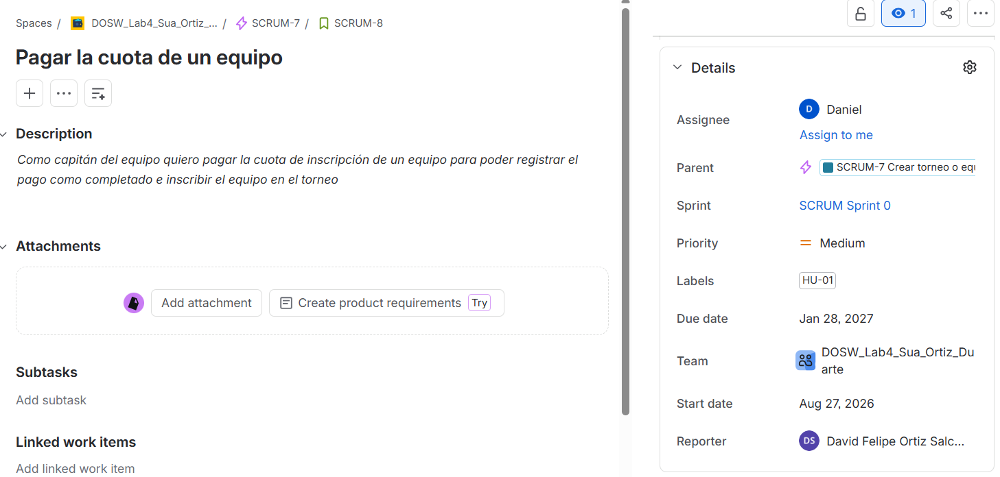
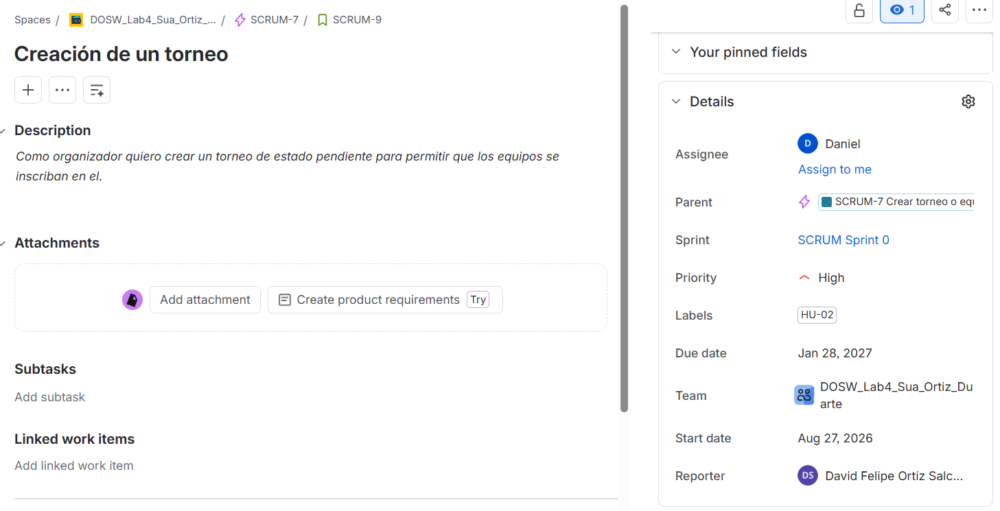
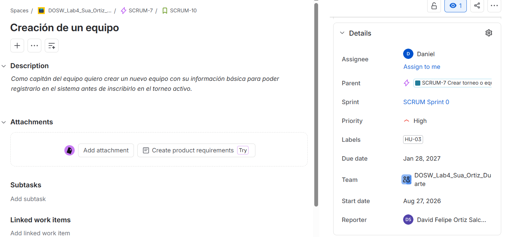
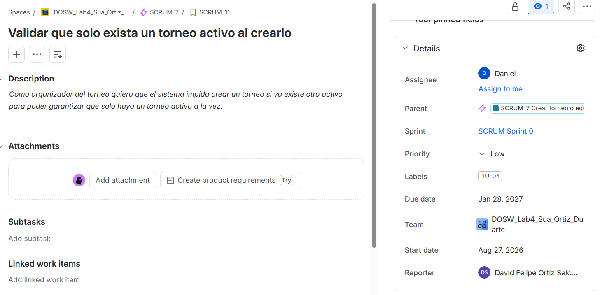
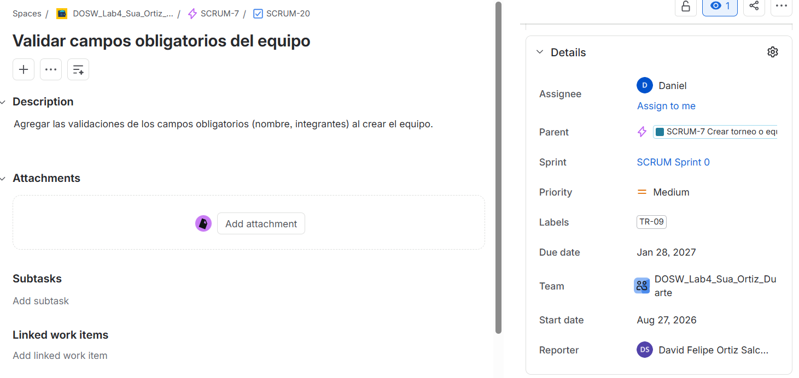
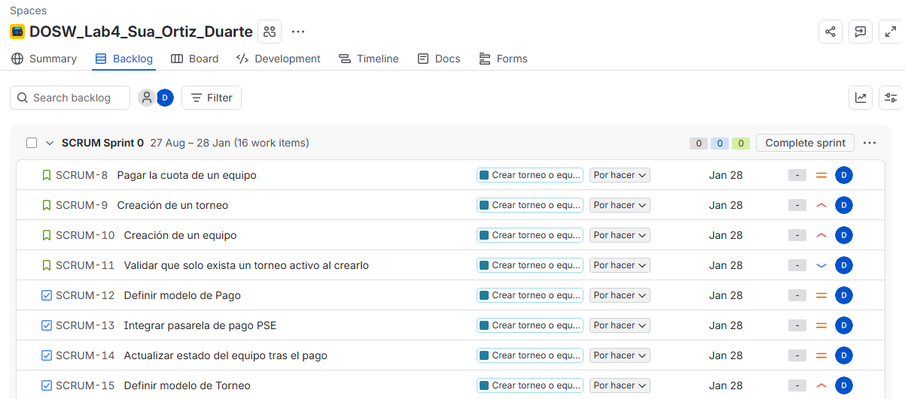
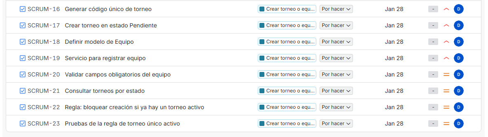

# 📄 Planeación del Sistema en Jira

## Desglose de trabajo: Épicas, Historias de Usuario y Tareas

La implementación de los requerimientos identificados de TechCup se desglosa de la siguiente manera:

### 1. Épica:

Evidencia de la épica elegida del caso de estudio en Jira:

### 2. Historias de usuario:

**Primera historia de usuario**

**Segunda historia de usuario**

**Tercera historia de usuario**

**Cuarta historia de usuario**

### 3. Tareas:

**Primera tarea**

**Segunda tarea**

**Tercera tarea**

**Cuarta tarea**

**Quinta tarea**

**Sexta tarea**

**Séptima tarea**

**Octava tarea**

**Novena tarea**

**Décima tarea**

**Décimo Primera tarea**

**Décimo Segunda tarea**

### 4. Cronograma:

### 5. Backlog:

